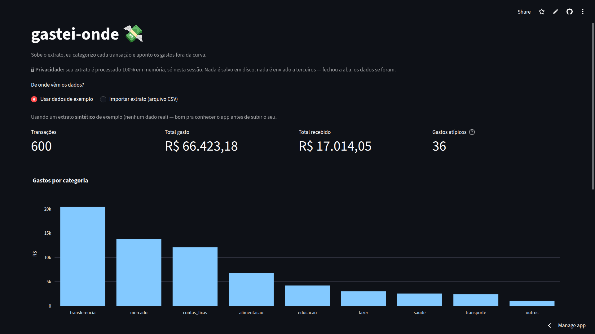
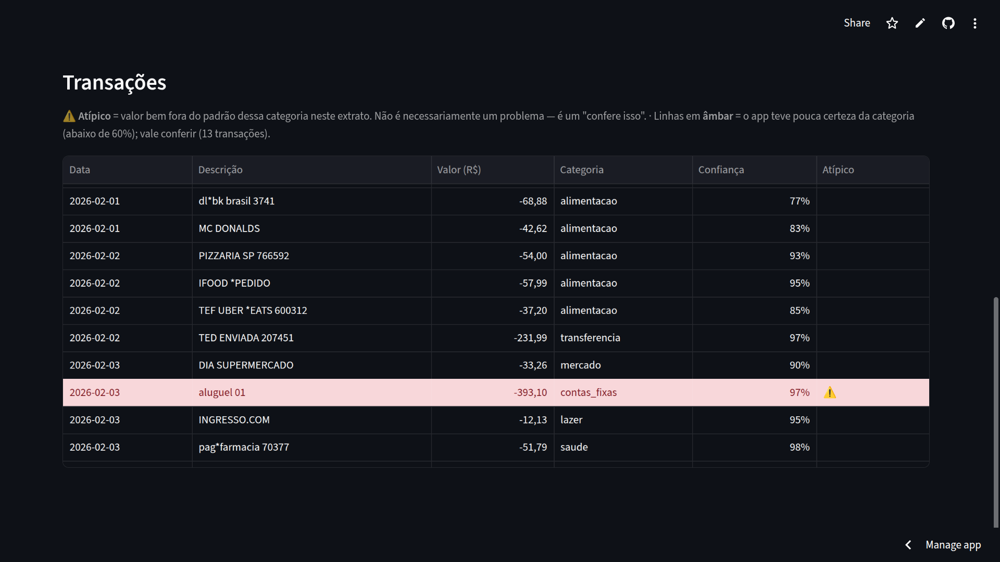
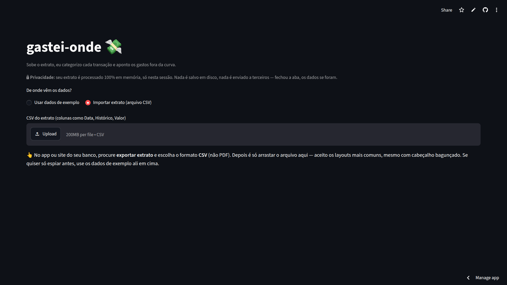

# gastei-onde 💸

> Sobe o CSV do extrato bancário, o app **categoriza cada transação**, mostra **o quanto
> ele confia** em cada palpite e **destaca os gastos fora da curva** — tudo num dashboard.

### Demo ao vivo: **[gastei-onde.streamlit.app](https://gastei-onde.streamlit.app)**

Extrato de banco é bagunçado: `PAG*IFD`, `TEF UBER *TRIP`, `PIX ENVIADO`... bater o olho e
entender pra onde o dinheiro foi é chato. Este projeto transforma essa bagunça em categorias
legíveis (alimentação, transporte, mercado, contas fixas, ...), e — em vez de fingir certeza —
**sinaliza as transações em que não confia** pra você revisar.



---

## Como funciona (e por que assim)

O coração é um classificador de texto que enxerga a descrição já limpa (`COMPRA IFOOD *PEDIDO
26499` → `ifood pedido`):

| Decisão | Por quê |
|---|---|
| **TF-IDF de n-grama de _caractere_** (char_wb 3–5) | Variações como `ifd` e `ifood` compartilham subsequências de letras, não tokens inteiros. N-grama de caractere captura esse parentesco; n-grama de palavra perderia. |
| **Regressão logística** `class_weight="balanced"` | As classes são desbalanceadas (saúde/educação são raras). O balanceamento protege o _recall_ delas em vez de otimizar só a acurácia global. |
| **Baseline por regras _antes_ do ML** | É o piso. O ML só se justifica se superar regra boa e barata — e o interessante é **onde** ele supera (abaixo). |
| **Confiança por predição** (`max(predict_proba)`) | O app marca em âmbar o que ficou abaixo de 60% de confiança. Uma regra binária dá "certo/errado"; o ML entrega "o quanto apostar". |
| **Anomalia por mediana + MAD, _por categoria_** | R$300 em mercado é rotina; R$300 em lazer é fora da curva — o desvio é medido dentro da categoria. Mediana/MAD (e não média/desvio) não são contaminados pelos próprios outliers que se quer caçar. Escolhi isso em vez de IsolationForest porque é **interpretável**: dá pra explicar o flag pro usuário. |

Na tabela, cada transação mostra a categoria prevista, **a confiança do modelo** e o destaque
de gasto atípico (linha realçada) — descrições cruas viram informação acionável:



### O argumento central

Numa base com a mesma distribuição do treino, o baseline por regras até empata com o ML
(o dado sintético tem descrições derivadas de palavras-chave, então regra vai bem). **O ML
ganha de verdade quando o lojista aparece com uma grafia nova** — exatamente o que acontece
no mundo real:

| Cenário | ML | Regras |
|---|:--:|:--:|
| Mesma distribuição do treino | 0,927 | 0,947 |
| **Grafia nova de um lojista conhecido** | **0,967** | 0,000 |
| Lojista totalmente inédito *(limite honesto)* | 0,154 | 0,000 |

Quando a marca é **100% inédita**, o modelo não tem como acertar por texto (acaso ≈ 1/9) —
e isso está documentado como limitação, não escondido.

**Outras métricas (holdout estratificado):** AUC OvR macro **0,987**; a confiança separa bem
acerto de erro (média 0,87 nos acertos vs 0,59 nos erros) — com o corte em 0,60 o app cobre
**89%** das transações com **96%** de acerto e manda o resto pra revisão.

---

## Melhora baseada em feedback real

Depois de subir o app, pedi pra pessoas **não-técnicas** da minha família usarem com o
extrato real do banco delas — e observei sem ajudar. O que travou virou correção:

| Feedback do usuário | O que mudou no app |
|---|---|
| "Apareceu *atípico* no **saldo do dia**" | Linhas de saldo passam a ser ignoradas — não são transação. |
| "O extrato é difícil de separar" (banco que parte a descrição em duas colunas) | App passa a concatenar a coluna de detalhes do lançamento, então o modelo vê o favorecido. |
| "*Atípico* pega todos os valores maiores?" | Explicação em linguagem simples na tela (o termo não se explicava sozinho). |
| "Muda *Subir CSV* pra *Importar extrato*" | Texto do botão ajustado — palavra do usuário, não jargão de tech. |
| "A tela inicial parece um erro" | Avisos viraram texto leve em vez de caixas de alerta empilhadas. |

Cada item virou um commit datado — dá pra acompanhar a evolução no histórico. A própria tela
de importação foi pensada pra quem não é técnico: orienta onde achar o "exportar extrato",
reforça que é CSV (não PDF) e deixa o aviso de privacidade visível antes de qualquer upload.



## Limitações (de propósito, à mostra)

- **Perfil 100% Pix:** o prefixo "Pix enviado/recebido" domina a descrição e ofusca o
  favorecido, então muita coisa cai em _transferência_. Confirmado em dois extratos reais.
- **Lojista inédito:** sem nenhuma pista de texto vista no treino, o palpite vira acaso — mas
  a baixa confiança sinaliza isso pro usuário.
- **Fora de escopo:** extratos em PDF e faturas de cartão de crédito (o app espera CSV de
  extrato de conta).

---

## Como rodar localmente

```bash
python -m venv .venv
source .venv/bin/activate        # Windows: .venv\Scripts\activate
pip install -r requirements.txt
streamlit run app.py
```

O app já vem com um **extrato sintético de exemplo** — dá pra explorar sem subir nada.

## Testes e CI

```bash
pytest        # 48 testes
```

A suíte cobre os núcleos (normalização de texto, regras, anomalia) e a **ingestão de CSV**,
onde moram testes de regressão pros casos reais que quebraram — filtro de saldo, descrição
partida, valor em formato BR, escolha de delimitador. Tudo roda no **GitHub Actions** a cada
push, mantendo a `main` sempre publicável.

## Privacidade

O CSV é processado **100% em memória, durante a sua sessão**: nada é salvo em disco, nada é
enviado a terceiros, nada é registrado — fechou a aba, os dados somem. Este repositório
**não contém dados reais**, apenas dados sintéticos gerados por código.

## Estrutura

```
gastei-onde/
├── app.py                       # app Streamlit (upload, dashboard, destaques)
├── src/
│   ├── data/generate.py         # gerador de extrato sintético
│   ├── features/text.py         # normalização + TF-IDF + features numéricas
│   └── models/
│       ├── rules.py             # baseline por regras (piso)
│       ├── train.py             # pipeline ML, avaliação e experimentos
│       └── anomaly.py           # detecção de gastos atípicos (mediana + MAD)
├── notebooks/                   # exploração (EDA) e modelagem, com gráficos
├── tests/                       # suíte pytest (núcleos + regressão de ingestão)
└── .github/workflows/ci.yml     # CI: testes a cada push
```

## Stack

**Python** · **pandas** · **scikit-learn** · **Streamlit** · **Plotly** · **pytest**

## Licença

MIT — veja [LICENSE](LICENSE).
